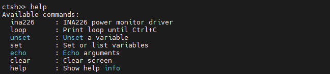
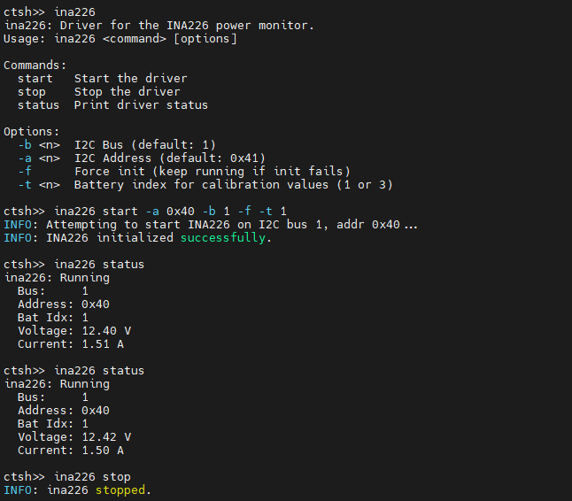
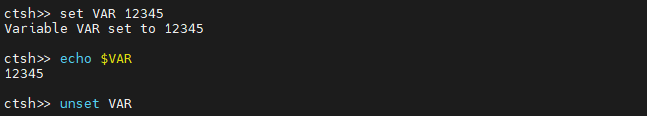
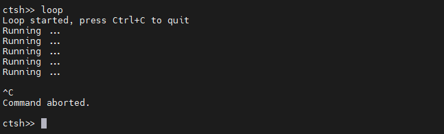

ctshell
=======

.. image:: https://img.shields.io/github/license/MDLZCOOL/ctshell
   :target: https://github.com/MDLZCOOL/ctshell/blob/main/LICENSE
   :alt: license

Ctshell is a low-overhead shell designed specifically for resource-constrained embedded systems.

Highlights
-------

* Tab Completion: Supports auto-completion for commands using the TAB key.
* Command History: Supports cycling through history entries using Up (↑) and Down (↓) arrow keys.
* Line Editing: Supports cursor movement (Left/Right), Backspace handling, and inserting text anywhere in the line.
* Environment Variables: Supports setting, unsetting, listing variables, and expanding them inline using the ``$`` prefix.
* Non-blocking Architecture: Decoupled input and processing, making it compatible with both bare-metal and RTOS environments.
* Signal Handling (SIGINT): Implements setjmp/longjmp logic to abort long-running commands via ``Ctrl+C``.
* Built-in Argument Parser: Includes a strictly-typed argument parser to easily handle flags (bool), integers, strings, and verbs within custom commands.
* ANSI Escape Sequence Support: Handles standard VT100/ANSI escape codes for arrow keys and screen control.
* Filesystem Support: Out-of-box for ``FatFS`` now, other fs native support will come soon.
* Command Hierarchy Framework: Supports hierarchical command management, see //////////////////////////.

Porting
-------

Ctshell is easy to port — native port implementations for multiple mainstream embedded platforms are provided out of the box.

For other details, please refer to the docs.

Demo
-------

Ctshell provides an intuitive interactive experience, and the core function demonstrations are as follows:

**View All Available Commands**

Use the ``help`` command to quickly list all available commands and their brief descriptions.

**Embedded System Debugging**

Integrate ctshell into your embedded project to quickly debug peripheral/module status.

**Environment Variable Operation**

Flexibly manage environment variables with ``set``/``unset`` commands, and expand variables with ``$`` prefix.

**Abort Long-running Commands**

Use ``Ctrl+C`` (SIGINT) to immediately terminate dead loops/long-running commands without crashing the system.

Basic Usage
-------

This part only covers the basic usage for customizing commands (port details are not involved). The implementation only requires two key steps: implement the custom command function and export the command with a single macro. Ctshell automatically handles underlying work such as command registration, list maintenance, and argument parsing.

The following takes the command development of the INA226 power monitor driver as an example to fully demonstrate the implementation of complex commands with verbs (subcommands) and multi-type arguments which is the most typical usage scenario of ctshell commands in embedded development.

.. code-block:: c

    #include "ctshell.h"

    int cmd_ina226(int argc, char *argv[]) {
        if (argc < 2) {
            ina226_print_usage();
            return 0;
        }
        
        // Initialize ctshell argument parser
        ctshell_arg_parser_t parser;
        ctshell_args_init(&parser, argc, argv);
        
        // Declare expected subcommands
        ctshell_expect_verb(&parser, "start");
        ctshell_expect_verb(&parser, "stop");
        ctshell_expect_verb(&parser, "status");
        
        // Declare expected arguments which is strictly typed, format (parser, short option, argument alias)
        // Alias is used for value retrieval later
        ctshell_expect_int(&parser, "-b", "bus");
        ctshell_expect_int(&parser, "-a", "addr");
        ctshell_expect_int(&parser, "-t", "battery_idx");
        ctshell_expect_bool(&parser, "-f", "keep_running");
        
        // Execute argument parsing, underlying layer automatically verifies argument type and format, no manual processing required
        ctshell_args_parse(&parser);

        // Execute business logic based on subcommands/arguments
        // ctshell_has: Check if the specified verb/argument is passed in
        // ctshell_get_*: Get argument value, implement optional arguments with default values
        if (ctshell_has(&parser, "start")) {
            int bus = ctshell_has(&parser, "bus") ? ctshell_get_int(&parser, "bus") : INA226_DEFAULT_BUS;
            int addr = ctshell_has(&parser, "addr") ? ctshell_get_int(&parser, "addr") : INA226_DEFAULT_ADDR;
            int bat_idx = ctshell_has(&parser, "battery_idx") ? ctshell_get_int(&parser, "battery_idx") : 1;
            int force = ctshell_get_bool(&parser, "keep_running");
            return ina226_start(bus, addr, bat_idx, force);
        } else if (ctshell_has(&parser, "stop")) {
            return ina226_stop();
        } else if (ctshell_has(&parser, "status")) {
            return ina226_status();
        } else {
            ina226_print_usage();
        }

        return 0;
    }
    // Export command with a single macro, ctshell registers it automatically, no manual command list maintenance
    // Macro parameters: <command name> <command function> <command description>
    CTSHELL_EXPORT_CMD(ina226, cmd_ina226, "INA226 power monitor driver");

After the command is registered, it can be used interactively in the ctshell terminal with arbitrary argument order. Here are the actual invocation methods of the ``ina226`` command above:

.. code-block:: shell

    # Start INA226: Use default I2C bus/address, battery index 2, enable continuous running
    ina226 start -t 2 -f

    # Start INA226: Specify I2C bus 1, device address 0x40, others use default values
    ina226 start -b 1 -a 64  # Decimal 64 for hex 0x40, ctshell supports decimal/hex input natively

    # Stop INA226 data collection
    ina226 stop

    # View INA226 current working status
    ina226 status

    # View command usage
    ina226

As you can see, ctshell delivers a streamlined interactive experience for embedded shell usage. It features an intuitive invocation flow for end users, with minimal learning curve and cognitive overhead.

Documentation
-------

Available at `ctshell Documentation <https://ctshell.readthedocs.io/zh-cn/latest/>`_.

License
-------

Copyright 2026 MDLZCOOL.

Distributed under the terms of the `Apache 2.0 license <https://github.com/MDLZCOOL/ctshell/blob/main/LICENSE>`_.

.. toctree::
   :maxdepth: 1
   :caption: Quick Start

   quickstart/porting

.. toctree::
   :maxdepth: 1
   :caption: API Reference

   api/api